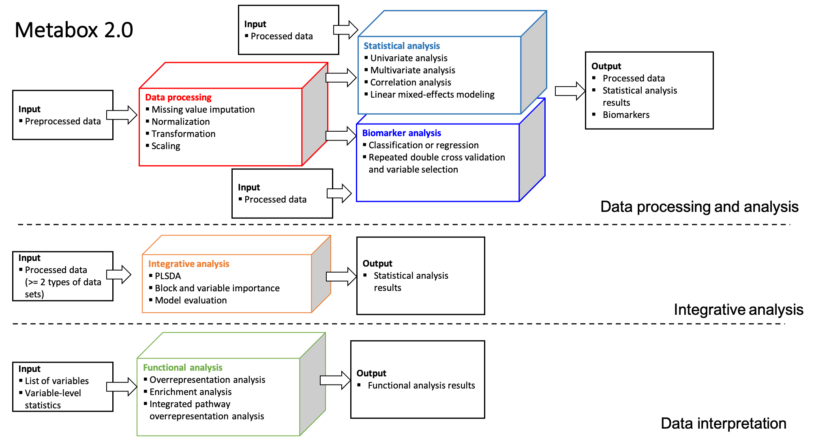

# Metabox 2.0
Metabox 2.0: A toolbox for thorough metabolomic data analysis, integration and interpretation. Metabox 2.0 is an updated version of the R package Metabox [metabox](https://github.com/kwanjeeraw/metabox), released in 2016. The tool includes several methods for data processing, statistical analysis, biomarker analysis, integrative analysis and data interpretation. Metabox 2.0 supports a wide range of users, from bench biologists to experienced bioinformaticians. It comes with an intuitive web interface for simple data analysis. We recommend the R command line version for custom pipelines and other exclusive projects.



Installation
============
* Install metabox2 and required packages using the following commands
```
##Install metabox2 ##
if (!require("remotes"))
  install.packages("remotes")
remotes::install_github("kwanjeeraw/metabox2")

##Install R dependencies ##
remotes::install_gitlab("CarlBrunius/MUVR")
if (!require("BiocManager"))
    install.packages("BiocManager")
BiocManager::install("pcaMethods")
BiocManager::install("affy")
BiocManager::install("preprocessCore")
BiocManager::install("vsn")
BiocManager::install("ropls")
BiocManager::install("piano")

##Run metabox2
library(metabox2)

##Run data transformation ##
input_dat = read_input_data('filename')
input_obj = set_input_obj(input_dat,idCol=1,classCol=2,xCol=3)
output_transform = transform_input_data(input_obj, method="log10")

##Run multivariate analysis ##
input_dat = read_input_data('filename')
input_obj = set_input_obj(input_dat,idCol=1,classCol=2,xCol=3)
output_multiv = multiv_analyze(input_obj, method = "pca", scale = "standard")

##(Optional) Use graphical user interface ##
launch_gui()
```

Using the online version
========================
We provide the following servers for the online version

* [server1](http://203.146.252.245:8081/metaboxweb/)
* [server2](http://203.146.252.245:8082/metaboxweb/)
* [server3](http://203.146.252.245:8083/metaboxweb/)

*Note: An online version is in high demand. Users might experience slow page loading. Currently, we are expanding our server and creating a portable docker image.*

Updates
=========
#### version 2.7 (APR 2024)
* Change number of cross-validation segments for multivariate analysis
* Change figure title
#### version 2.6 (JUNE 2023)
* Change report location
* Set default package color
* Update MUVR to current version
* Fix bug when running univariate analysis
#### version 2.5 (MAY 2023)
* Update pathway data for enrichment analysis
#### version 2.4 (MAR 2023)
* Add example data sets for GUI version
#### version 2.3 (FEB 2023)
* Summarize coefficient of variation (cv) and normality
* Fix default scaling of PCA plot
* Fix default color
#### version 2.2 (OCT 2022)
* Fix bug when running MUVR
#### version 2.1 (SEP 2022)
* More imputation methods: zero, half-min
* Allow scaling and block weighting by the block inertia
* Allow missing values in normalization, transformation and scaling
#### version 2.0 (JUL 2022)
* Initial version

References
=========
- Wanichthanarak K, In-On A, Fan S, Fiehn O, Wangwiwatsin A, Khoomrung S (2024) Data processing solutions to render metabolomics more quantitative: case studies in food and clinical metabolomics using Metabox 2.0. GigaScience 13(2024): [giae005](https://10.1093/gigascience/giae005)
- Wanichthanarak K, Fan S, Grapov D, Barupal DK, Fiehn O (2017) Metabox: A Toolbox for Metabolomic Data Analysis, Interpretation and Integrative Exploration. PLOS ONE 12(1): [e0171046](https://doi.org/10.1371/journal.pone.0171046)

License
=========
[GNU General Public License (v3)](https://github.com/kwanjeeraw/metabox2/blob/master/LICENSE)
