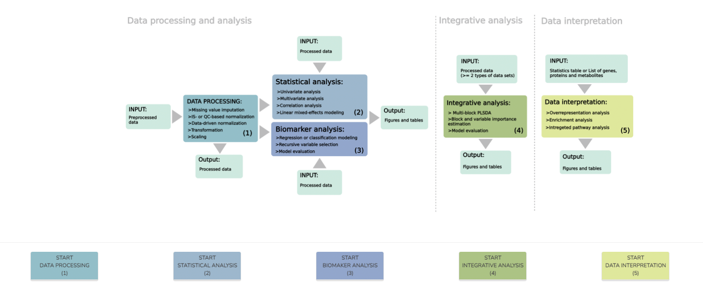

# Metabox 2.0
Metabox 2.0: A toolbox for thorough metabolomics data processing, analysis, integration and interpretatin.
The tool includes several methods for data processing, statistical analysis, biomarker analysis and data interpretation.


To install the package:
```
devtools::install_github("kwanjeeraw/metabox2")
library(metabox2)

```
