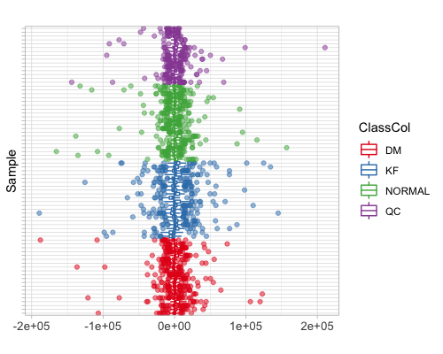
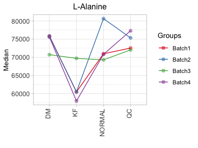
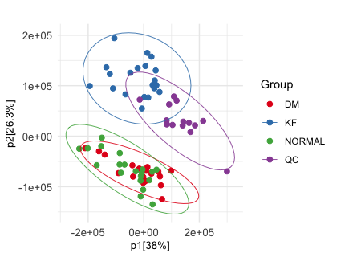
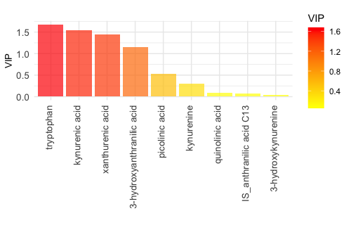
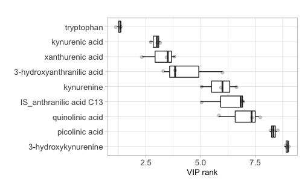
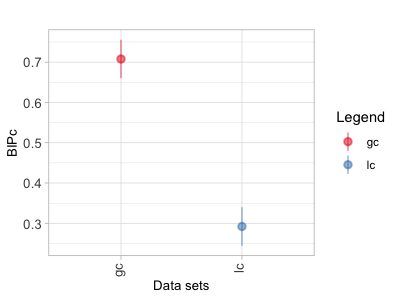
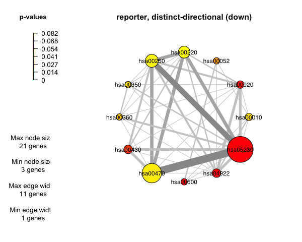

```{r, include = FALSE}
knitr::opts_chunk$set(
  collapse = TRUE,
  comment = "#>"
)
```

## 1 INSTALLATION

Install metabox2 and required packages using the following commands:

```
##Install metabox2 ##
if (!require("devtools"))
  install.packages("devtools")
devtools::install_github("kwanjeeraw/metabox2")
library(metabox2)

##(Optional) Using graphical user interface (GUI) version ##
install.packages("shiny") #Skip this step, if shiny package is alreay installed
launch_gui()
```

## 2 DATA PROCESSING

Example commands for Data processing module:

**Loading input data**

```
input_dat = read_input_data('GCGC_DM_Samples.csv') #load input file
input_obj = set_input_obj(input_dat,idCol=1,classCol=3,xCol=6) #setup metabox object
head(input_obj$X) #preview input data
```

**Missing value imputation**

```
output_imputed = impute_missing_data(input_obj, method="rf")
head(output_imputed$X) #preview imputed data
```

**CCMN Normalization**

```
output_norm = normalize_input_data_byqc(output_imputed, method="ccmn", istd=1:2, factorCol=3)
head(output_norm$X) #preview normalized data
```

**Square root transformation**

```
output_sqrt = transform_input_data(output_norm, method="sqrt")
head(output_sqrt$X) #preview transformed data
```

**Pareto scaling**

```
output_pareto = scale_input_data(output_norm, method="pareto")
head(output_pareto$X) #preview scaled data
```

**Observing data with different plots**

```
pcaplot_overview(output_sqrt, classCol=3) #PCA plot
rlaplot_overview(output_sqrt, classCol=3, dolog = FALSE) #RLA plot
densityplot_overview(output_sqrt$X, plotvar=TRUE) #Variable density plot
densityplot_overview(output_sqrt$X, plotvar=FALSE) #Sample density plot
boxplot_overview(output_sqrt, plotvar=TRUE) #Variable boxplot
boxplot_overview(output_sqrt, plotvar=FALSE) #Sample boxplot
```


## 3 STATISTICAL ANALYSIS

Example commands for Statistical analysis module:

**Univariate analysis**

```
output_univ= univ_analyze(output_sqrt, var.equal = FALSE, ispara = FALSE, doposthoc = FALSE)
str(output_univ) #preview statistical result
boxplot_byF1(output_sqrt,xCol = 3,factorLv1 = output_sqrt$Y) #boxplot by a fator
boxplot_byF1F2(output_sqrt,xCol = 3,factorLv1 = output_sqrt$Y,
factorLv2=output_sqrt$inputdata$Batch) #boxplot by 2 fators
interactionplot_byF1F2(output_sqrt$X,xCol = 3,factorLv1 = output_sqrt$Y,
factorLv2 = output_sqrt$inputdata$Batch) #interaction plot
```


**Correlation analysis**

```
output_corr= correlation_analyze(output_sqrt, method="pearson")
str(output_corr) #preview statistical result
corrplot_heatmap(data.frame(output_corr$corr_data)) #correlation heatmap
```

**PCA analysis**

```
output_pca= multiv_analyze(output_sqrt, method="pca", scale="center") #PCA
str(output_pca) #preview statistical result
multiv_scoreplot(output_sqrt,score_data = output_pca$score_val,
pcx = output_pca$model_summary$R2X[1],pcy = output_pca$model_summary$R2X[2]) #PCA score plot
multiv_loadingplot(output_pca$loading_val) #Loading plot
multiv_loadingplot_bypc(output_pca$loading_val,pc = 1) #Loding plot of PC1
```


**PLS-DA analysis**

```
output_plsda= multiv_analyze(output_sqrt, method="pls", scale="center") #PLS-DA
str(output_plsda) #preview statistical result
multiv_scoreplot(output_sqrt,score_data = output_plsda$score_val,
pcx = output_plsda$model_summary$R2X[1],pcy = output_plsda$model_summary$R2X[2]) #PLS-DA score plot
multiv_loadingplot(output_plsda$loading_val) #Loading plot
multiv_loadingplot_bypc(output_plsda$loading_val,pc = 1) #Loding plot of PC1
multiv_vipplot(output_plsda$vip_val) #VIP plot
```

**OPLS-DA analysis**

```
input_dat = read_input_data('LC_LN_Samples.csv') #load input file
input_obj = set_input_obj(input_dat,idCol=1,classCol=2,xCol=3) #setup metabox object
head(input_obj$X) #preview input data
output_oplsda= multiv_analyze(input_obj, method="opls", scale="pareto") #OPLS-DA
str(output_oplsda) #preview statistical result
multiv_scoreplot(input_obj,score_data = output_oplsda$score_val,
oscore_data = output_oplsda$oscore_val,pcx = output_oplsda$model_summary$R2X[1],
pcy = output_oplsda$model_summary$R2X[2]) #OPLS-DA score plot
multiv_loadingplot(loading_data = output_oplsda$loading_val,
oloading_data = output_oplsda$oloading_val) #Loading plot
multiv_loadingplot_bypc(output_oplsda$loading_val,pc = 1) #Loding plot of PC1
multiv_vipplot(output_oplsda$vip_val) #VIP plot
```


## 4 BIOMARKER ANALYSIS

Example commands for Biomarker analysis module:

```
input_dat = read_input_data('LC_LN_Samples.csv') #load input file
input_obj = set_input_obj(input_dat,idCol=1,classCol=2,xCol=3) #setup metabox object
head(input_obj$X) #preview input data
output_muvr = run_muvr(input_obj, scale = FALSE, method="PLS") #biomarker analysis using PLS model
MUVR_getvip(output_muvr) #Get VIP ranks
MUVR_plotvip(output_muvr) #VIP rank plot
MUVR_plotval(output_muvr) #Validation plot
```


## 5 INTEGRATIVE ANALYSIS

Example commands for Integrative analysis module:

```
input_dat1 = read_input_data('LC_Fat_Tissue.csv') #load input file1
input_obj1 = set_input_obj(input_dat1,idCol=1,classCol=3,xCol=4) #setup metabox object
input_dat2 = read_input_data('GC_Fat_Tissue.csv') #load input file2
input_obj2 = set_input_obj(input_dat2,idCol=1,classCol=3,xCol=4) #setup metabox object
output_mbpls = mbplsda_analyze(data.frame(input_obj1$Y), 
list(lc = input_obj1$X,gc = input_obj2$X),nrepet=10, 
npermut=5, nboot=5, testmodel=TRUE, cpus=1) #integrative analysis
mbplsda_plottestdim(output_mbpls$result$res_optimal) #Prediction error rate plot
mbplsda_plotpermut(output_mbpls$result$res_permut) #Permutation testing plot
mbplsda_screeplot(output_mbpls$result$base_model$eig) #Scree plot
mbplsda_plotboot_vipc(output_mbpls$result$res_boot) #Variable importance plot
mbplsda_plotboot_bipc(output_mbpls$result$res_boot) #Block importance plot
```


## 6 DATA INTERPRETATION

Example commands for Data interpretation module:

**Overrepresentation analysis**

```
#pathway, metabolite ORA
output_ora1=overrep_analyze(fnanal_data$compound_data$kegg, nodetype="compound", size=5)
head(output_ora1$enrichment) #preview result
#pathway, protein ORA
output_ora2=overrep_analyze(fnanal_data$combined_data$id[1:9], nodetype="protein", size=3)
head(output_ora2$enrichment) #preview result
#chemical class ORA
output_ora3=overrep_analyze(fnanal_data$compound_data$hmdb, settype="chemicalclass")
head(output_ora3$enrichment) #preview result
```

**Pathway enrichment analysis**

```
#enrichment analysis containing directional values (Fold-change)
output_enr=enrichment_analyze(fnanal_data$compound_data, pcol=5, fccol=6, method="reporter", 
nodetype="compound", settype="pathway")
head(output_enr$enrichment) #preview result
#enrichment network plot by piano package (optional)
piano::networkPlot2(output_enr$network,class="distinct",direction = "down",significance=0.1,lay = 5)
```


**Integrated pathway overrepresentation analysis**

```
#integrated pathway ORA
output_ora = comb_overrep_analyze(fnanal_data$combined_data, organism = "hsa", size = 3)
head(output_ora$enrichment) #preview result
```
